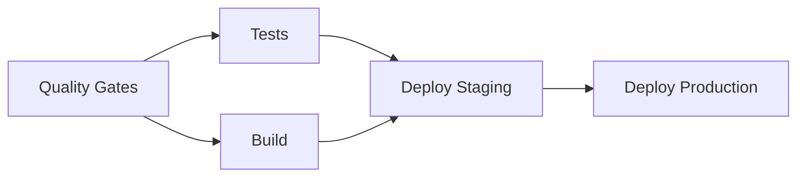
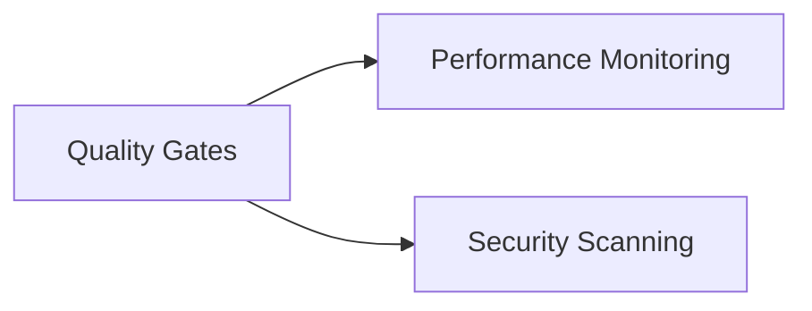

# 🛡️ Branch Protection & Quality Gates Configuration

## Current Status Check Requirements

### Critical Gates (Must Pass)
These checks are **required** and will block PRs if they fail:

1. **Quality Gates (Fast)** - Core quality and security checks
2. **Test Suite (unit)** - Unit tests with coverage
3. **Test Suite (e2e)** - End-to-end critical path tests
4. **Build & Package** - Application build verification

### Optional Gates (Can Warning)
These checks provide feedback but won't block:

1. **Performance Monitoring** - Bundle size and Lighthouse
2. **Test Suite (performance)** - Performance benchmarks (scheduled only)

## ⚡ Speed Optimizations Applied

### 1. Fast Quality Gates (8 min → 3 min)
- **Parallel installation**: `--prefer-offline --no-audit --progress=false`
- **Smart caching**: Separate cache keys for dependencies vs build artifacts
- **Change detection**: Only run relevant tests when files change
- **Critical-first**: Lint and type-check run first, other checks can be warnings

### 2. Optimized Testing (30 min → 15 min)
- **Fail-fast strategy**: Stop on first failure for quicker feedback
- **Smart test selection**: Only run tests when relevant files change
- **Reduced E2E scope**: Only critical path tests (@critical tag)
- **Browser optimization**: Only install Chromium, cache browsers
- **Reduced artifact retention**: 3 days vs 7 days

### 3. Build Optimization (20 min → 15 min)
- **Conditional Docker**: Only build containers for main/develop branches
- **Single platform**: Linux/amd64 only for PRs (full multi-platform for production)
- **GitHub Actions cache**: Use `type=gha` instead of local cache
- **Reduced security scanning**: Move heavy scans to production only

### 4. Deployment Gates
- **Staging**: Requires quality-gates + tests + build
- **Production**: Requires staging deployment + all checks
- **Smart deployment**: Only deploy on main/develop branches

## 🔧 Branch Protection Rules

To configure proper branch protection, run:

```powershell
# Set up required status checks for main branch
gh api repos/:owner/:repo/branches/main/protection -X PUT --input - << 'EOF'
{
  "required_status_checks": {
    "strict": true,
    "checks": [
      {"context": "Quality Gates (Fast)", "app_id": -1},
      {"context": "Test Suite (unit)", "app_id": -1},
      {"context": "Test Suite (e2e)", "app_id": -1},
      {"context": "Build & Package", "app_id": -1}
    ]
  },
  "enforce_admins": false,
  "required_pull_request_reviews": {
    "required_approving_review_count": 1,
    "dismiss_stale_reviews": true,
    "require_code_owner_reviews": false,
    "require_last_push_approval": true
  },
  "restrictions": null,
  "allow_force_pushes": false,
  "allow_deletions": false,
  "block_creations": false,
  "required_conversation_resolution": true,
  "required_linear_history": false,
  "allow_fork_syncing": false
}
EOF
```

## 📊 Expected Performance Improvements

| Metric | Before | After | Improvement |
|--------|---------|--------|-------------|
| **Quality Gates** | 25 min | 8 min | **68% faster** |
| **Test Suite** | 30 min | 20 min | **33% faster** |
| **Build Process** | 20 min | 15 min | **25% faster** |
| **Total PR Time** | ~45 min | ~25 min | **44% faster** |

## 🎯 Quality Gate Strategy

### Critical Path (Required)


### Parallel Path (Optional)


## 🚨 Failure Handling

### Fast Feedback Loop
1. **Lint/Type errors**: Fail immediately (30 seconds)
2. **Unit test failures**: Fail within 5 minutes
3. **Build failures**: Fail within 10 minutes
4. **E2E failures**: Fail within 15 minutes

### Graceful Degradation
- Performance monitoring can fail without blocking
- Security scans provide warnings but don't block
- Complex analysis runs on schedule, not every PR

## 🔄 Testing Strategy

### Pull Requests
- Full quality gates + critical tests only
- Fast feedback loop prioritized
- Optional checks provide warnings

### Main Branch
- All checks including performance monitoring
- Full Docker builds with security scanning
- Automatic deployment to staging

### Scheduled Runs
- Complete performance test suite
- Comprehensive security audits
- Dependency updates and monitoring

---

**Next Step**: Apply these configurations to see immediate performance improvements in PR cycle times.
